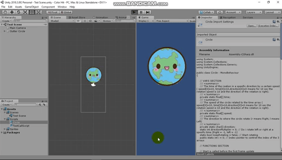

# 2D-Rotation-map-in-unity

## Preview
  This section provide an overview of the Rotation Code.
  The Rotation class is a very modular class that you can use in your project to Rotate 2D objects with given direction and speed for a     specific time and keep changing those values as you pleases, this code help you make levels where you need to rotate things like this without going in depth of how to do it .
  
  
## How to use it 
  All you need to use this project is 
